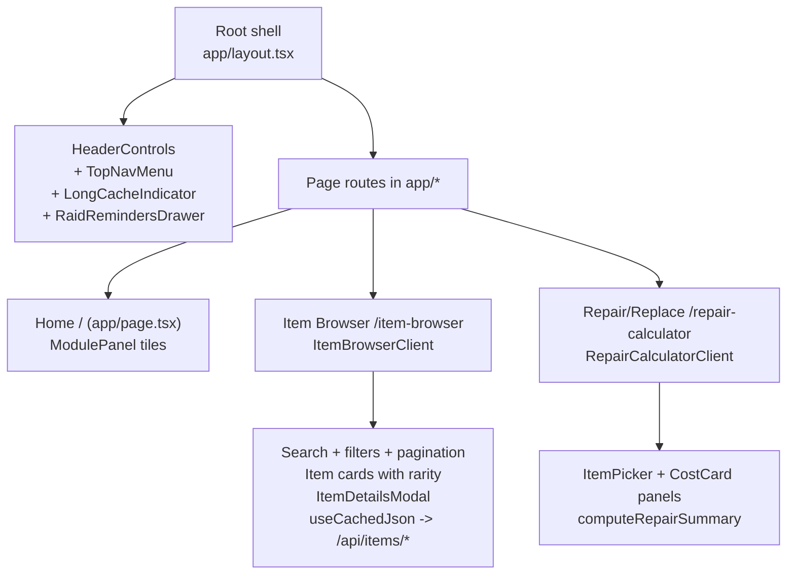

# Raider Pal UI Index

This guide maps UI ownership and composition for the current screens and shared components.

## Shell and navigation
- app/layout.tsx: global chrome, fonts, header/footer, PWA registration, analytics, and dev cache debug panel.
- components/rp/HeaderControls.tsx: header actions including Raid Reminders, cache indicator, and the menu trigger.
- components/rp/TopNavMenu.tsx: portal navigation menu with route links and a shortcut to cache settings.
- components/rp/LongCacheToggle.tsx: long-term cache indicator and settings modal.
- components/rp/RaidRemindersDrawer.tsx: portal drawer for saved items and notes.

## UI primitives (components/ui)
- Panel, Card, ModulePanel, SectionHeader, CardHeader: layout shells and headers.
- Button, PrimaryButton: action components.
- ToolShell, ToolPanel, ToolGrid: layout wrappers for tool pages.
- PaginationControls: pagination UI.
- RarityBadge and rarityClasses: rarity styling helpers.
- CostCard: cost breakdown display.

## Feature components (components/rp)
- ItemBrowserClient, ItemDetailsModal, ItemDetailsTabs, ItemRowCard, ItemPicker-portal: item browsing UI.
- RepairCalculatorClient, RangeSlider: repair calculator UI and slider input.
- PWARegistration: production service worker registration.
- InstallPrompt: standalone PWA install prompt component (not mounted in the root layout).

## Page composition
- Home (app/page.tsx) uses ToolPanel with ModulePanel tiles for Item Browser, Repair Calculator, and About.
- Item Browser (app/item-browser/page.tsx) uses SectionHeader + Card for the summary header and mounts ItemBrowserClient for filters, pagination, and item previews.
- Repair Calculator (app/repair-calculator/page.tsx) uses ToolPanel density="compact" with SectionHeader + Card, then mounts RepairCalculatorClient.

## Data and state in the UI
- Server pages fetch initial data via lib/data repositories.
- Client components fetch per-item detail via /api/items/* using useCachedJson with response and data schemas.
- useAppVersion provides the dataset version used for cache keys.
- useRaidReminders stores reminders and notes in localStorage.
