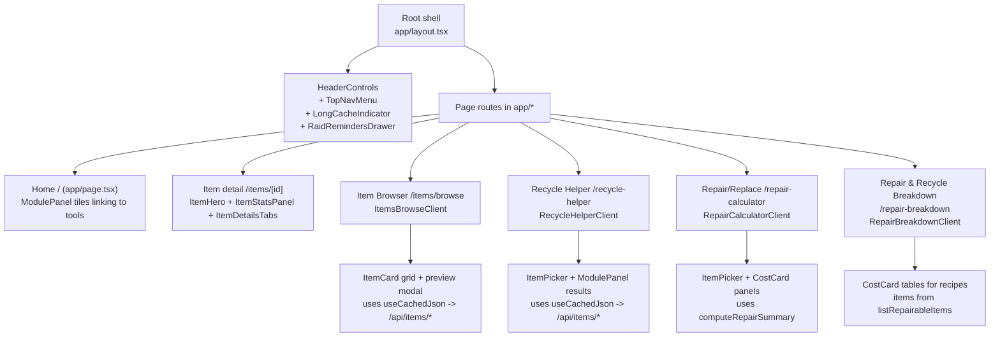

# Raider Pal UI Index

This guide maps the UI ownership and shows where to work when adjusting screens or flows. Pair this with `docs/app-architecture.md` for data-path details.



## Shell and navigation
- `app/layout.tsx`: Global chrome (header, footer stripe, max-width container) and font setup.
- `components/HeaderControls.tsx`: Header right rail; owns reminder drawer toggling and cache indicator button.
- `components/TopNavMenu.tsx`: Portal-based nav menu; owns routing links and Long Term Caching settings modal.
- `components/RaidRemindersDrawer.tsx`: Slide-out list of saved items via `useRaidReminders`.
- `components/LongCacheToggle.tsx`: Indicator + settings modal for cache duration.

## Shared building blocks
- Containers: `components/ui/Panel.tsx` (base card shell), `components/ModulePanel.tsx` (titled panel with rows), `components/ToolPanel.tsx` (Panel + spacing wrapper), `components/ui/Card.tsx` (lighter surface), `components/ContentContainer.tsx` (flex/grid helper for sidebar layouts).
- Actions: `components/ui/Button.tsx`, `components/PrimaryButton.tsx`, `components/TwoOptionToggle.tsx`.
- Item display: `components/ItemCard.tsx` (list/grid card + rarity badge), `components/ItemHero.tsx` (large hero with description), `components/ItemStatsPanel.tsx` (value/type/workbench/loot badge stack), `components/SelectedItemSummary.tsx` (compact header with icon and rarity).
- Pickers & tables: `components/ItemPicker.tsx` (searchable dropdown), `components/ItemDetailsTabs.tsx` (crafting/recycling/sources/used-in tabs), `components/costs.tsx` (CostCard + helpers for recipe rows).
- Search & navigation: `components/SearchControls.tsx` (search input + filter dropdown), `components/PaginationControls.tsx` (page navigation with window), `components/PreviewModal.tsx` (item detail modal with focus management).
- Layout helpers: `components/Sidebar.tsx`, `components/ToolPanel.tsx`, `components/ModulePanel.tsx` are the common shells to keep spacing consistent.

## Page owners (where to edit)
- Home (`app/page.tsx`): Landing tiles built with `ModulePanel` + `PrimaryButton` links. Add/remove tools here.
- Item list (`app/items/page.tsx`): Minimal server page; renders `ItemsList` (client-side search of provided items).
- Item browser (`app/items/browse/page.tsx`): Server wrapper fetches item summaries + dataset version. UI lives in `components/ItemsBrowseClient.tsx` (refactored from 557 to 292 lines) which composes `SearchControls`, `PaginationControls`, and `PreviewModal`. Modal fetches crafting/recycling data via `useCachedJson`.
- Item detail (`app/items/[id]/page.tsx`): Server-rendered detail view combining `ItemHero`, `ItemStatsPanel`, and `ItemDetailsTabs`. Data pulled directly from `lib/data` without an API hop.
- Recycle Helper (`app/recycle-helper/page.tsx`): Server wrapper feeds items and id sets; `components/RecycleHelperClient.tsx` owns mode switching (Need vs Have), filters, and results, and fetches row-level data with `useCachedJson`.
- Repair/Replace Calculator (`app/repair-calculator/page.tsx`): Server wrapper provides repairable items; `components/RepairCalculatorClient.tsx` runs `computeRepairSummary` and renders CostCards for per-cycle, crafting, recycling, and net costs.

## Data and state on the UI
- Server vs client: Pages fetch initial data on the server via `lib/data/**` repositories. Client components fetch incremental detail via `/api/items/*` using `useCachedJson` plus schemas from `lib/apiSchemas.ts`.
- Caching/versioning: `useAppVersion` and `dataVersion` props keep client fetches aligned with the dataset version. Long cache toggle controls `useCachedJson` durations.
- Local state helpers: `useRaidReminders` (persistent reminders), `useCachedJson` (validated fetch + cache), `useAppVersion` (reads API-reported version).
- Styling: Tailwind + semantic theme tokens in `tailwind.config.js` and `app/globals.css`. Always use theme colors (e.g., `text-primary`, `bg-surface-base`, `border-border-strong`) over default Tailwind classes or hardcoded values. Prefer composing `Panel`/`Card` and existing utility patterns before adding new globals. For migration: replace `text-primary` with `text-primary`, `text-muted` with `text-muted`, `border-slate-800` with `border-border-strong`, etc.
- Density mode: Page-level compact styling is opt-in via `ToolPanel` (`density="compact"`). Compact-only tweaks use the arbitrary variant selector `2xl:[.ui-compact_&]:...` so they only apply under a `.ui-compact` ancestor.

Example (compact-only tweak on a shared component):
```tsx
<div className="p-4 2xl:[.ui-compact_&]:p-3 space-y-3 2xl:[.ui-compact_&]:space-y-2.5">
  ...
</div>
```

## How to adjust or extend the UI
- Add a new tool tile on Home: update `app/page.tsx` with a `ModulePanel` entry and a `PrimaryButton` to the route; keep copy short and action-focused.
- Add a filter to the Item Browser: add state + filter logic in `ItemsBrowseClient.tsx`, wire inputs above the grid, and reset pagination when filters change.
- Add an action to item previews: extend `ItemCard` to accept `action`, or add buttons inside the preview modal in `ItemsBrowseClient.tsx`; keep keyboard handling (Enter/Space) intact.
- New data on item detail: add fields to the `get*` repo functions in `lib/data`, return them from the API if needed, and render in `ItemStatsPanel` or a new `TabList` in `ItemDetailsTabs`.
- New calculator view: create `app/<tool>/page.tsx` as a server wrapper that loads data via `lib/data`, then build a client component under `components/` using `ToolPanel` or `ModulePanel` for layout.
- To tighten desktop spacing on a single page: set `density="compact"` on that page's `ToolPanel`, then add compact overrides in shared components using `2xl:[.ui-compact_&]:...` (avoid per-page one-off classes).

## Usage examples
- Show a new numeric stat on item detail: extend the relevant repo/select in `lib/data/items.repo.ts`, pass the field through `app/items/[id]/page.tsx`, and render it inside `ItemStatsPanel` (add a badge block mirroring existing ones).
- Add a “Workbench” filter to Item Browser: add state to `ItemsBrowseClient`, include it in `filtered`, and add a `<select>` alongside the rarity dropdown; remember to `setPage(1)` when it changes.
- Surface reminder controls on any list: import `useRaidReminders`, use `isAdded(id)` to mark active rows, and `add`/`addMany` for actions; prefer passing small action buttons into `ItemCard.action`.

## Pointers for junior contributors
- Start from the page file under `app/*` to see what data is loaded and which client component actually renders the UI.
- Follow the pattern: server fetch for initial payload -> client component for interactions -> API routes for per-item detail via `useCachedJson`.
- Reuse shells (`Panel`, `ModulePanel`, `ToolPanel`) to get spacing, borders, and text styles “for free” and avoid one-off CSS.
- Keep fetch validation on: when adding an API response, supply `responseSchema`/`dataSchema` to `useCachedJson` so contract issues fail loudly.
- Test flows by toggling Long Term Caching (header menu) and using both Need/Have modes in Recycle Helper to catch filter edge cases.
